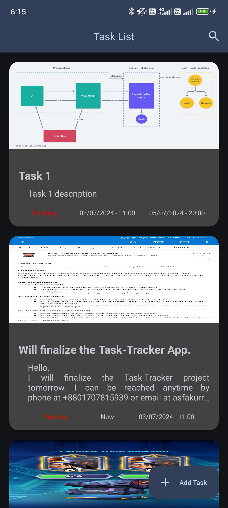

# Task Tracker

Task-Tracker is an Android App to track your tasks which you have to do.

## Build and Run:

To build and run the Application in your mobile you have to follow some steps.

- Clone the GitHub repository to you machine by using `git`
```bash
    git clone https://github.com/asfakur-rahat/Task-Tracker.git
```
- Now open the project to your android studio from `File/open`\
  
- Android studio should recognize the project as android project and start build Gradle process wait for some time and let the process finish.
- Download the `google-services.json` file from [here](https://drive.google.com/file/d/1vKn2qjSJmnrjaBsmcGwB-hYWpsCpa7NM/view?usp=sharing "google-service.json") and put it to app folder\
  
- After that you can click on run to run the app to your Emulator or a Physical device.

## About Task-Tracker:
By using task tracker you can now keep track of your task.\
Just create a task and you are ready to keep track of it.\
You can edit a created task or delete the task anytime you want\
and also you can mark the task as done if you want.
### Features:
- Task List Page
- Add New Tasks
- Delete an existing task
- Edit an existing task
- Add an image from your device to make the task more describable

### Screen shots of the features:
- **Task List Screen** \
  
  
- **Add New Task Screen** \
  
  
- **Task Details Screen & delete option** \
  
  
- **Edit Task Screen** \
  
  
- **Bottom Sheet to give user options** \
  
  

### Sample Video demontration of app functionality:

  

## Assumptions & decisions made during development.

- Using Coil for load image in image view
- Only call JSONPlaceholder API if the room databse is empty
- Disabled allpast date & time so that user can't pick the past time
- handled null image case manually so it doesn't make any error in firebase storage
- for MVVM Architecture i tried to follow this image.\
   
- And tried to commit to git whenever a stable feature was complete.